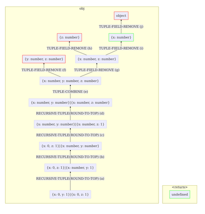

# Overview

The tool runs in three stages, to 1) download and extract the npm package, 2) instrument the test code to examine values passed in and out of functions, and 3) generate a set of candidate types for each function it has encountered. This page explains the operations of each of these stages, and references the underlying implementations.

## Downloading and extraction

The `Workspace` class performs the initial setup. It clones the project from the path provided on the command line, and installs it into the working directory. It then locates the test files by looking for a directory named "test" or "tests", or a file named tests.js*. The lib files are located by examining the `main` or `files` properties of the module's package.json**. To determine which functions are exported, the module's main file is `require`d, and the resulting object tree is followed recursively until all functions are found. To avoid having to instrument internal functions used by the library, only calls to publically available functions (a.k.a. those accessible from `require`) are considered, and calls to any other functions are ignored. In order to correlate functions available from the library to those which are accessed by tests, and to sidestep aliasing, two functions with the same name, etc, each library function is annotated with a unique tag. This tag is referenced between tests and the various TypeDeducer implementations.

Example of a function being tagged:
```javascript
Original:                                Tagged:
function max(a, b) {                     function max(a, b) {
                                             void 'id=1';
    return (a > b) ? a : b;                  return (a > b) ? a : b;
}                                        }

```

\* Because there is no requirement that tests reside in any particular directory, some or all of the tests may reside outside these locations, although these locations tend to be sensible places where tests are usually stored.

\** Since different projects may have very difficult conventions as to where code is stores, this is only the approximate way to get the source files, and is probably incomplete for larger projects. Watching the main library for which files it requires (excepting those in `node_modules/`) may be a good way to find these, but this is not yet implemented.

## Instrumentation

Prior to running tests, `Instrumentation` injects instrumentation code into each source file, using the JavaScript instrumenter [**aran**](https://github.com/lachrist/aran). Every time a function is called, a hook is invoked which records the arguments and return value. After running the tests with the project's test runner (invoking `npm test`), a trace of all function entry/exits is then parsed by `ExecutionTracer`, which creates a table of which functions were called with which arguments. If any functions were tagged but never invoked, a warning is printed to indicate that types for those functions will not be produced. During this stage, the name of all arguments is also collected, and if any functions were called with more parameters than there are named arguments*, the additionaly arguments are named `argN`, etc (where `N` is the index of the parameter that was provided). It then hands off this information to the next stage of the pipeline -- the type deducer.

\* This is perfectly allowed in javascript, and can be accessed by using the `arguments` object.

## Type Deduction

### Internal representation of types.
Each type is stored as a tree of components, with a `Type` as its root note and `TypeComponent`s as leaves. Each `TypeComponent` is responsible for the representation of the different kinds of types (null, undefined, boolean, number, string, function, array/tuple, and object). These implementations are available in the `types` subdirectory of this project.

For example, the tree corresponding to the type `number|string|{val: number|string}` would look like

```
                                  Type
                                   +
        +-------------------------------------------------------+
        +                          +                            +
NumberTypeComponent        StringTypeComponent         ObjectTypeComponent
        +                          +                            +
        +                          +                            +
     number                      string                (Named tuple object)
                                                                +
                                                                | x
                                                                +
                                                               Type
                                                                +
                                                  +-------------+--------------+
                                                  +                            +
                                           NumberTypeComponent        StringTypeComponent
                                                  +                            +
                                                  +                            +
                                                number                      string
``` 

The type deducer stage is responsible for determining valid types for each function. As stated in the [Design Goals](DesignGoals.md), the purpose of the type deducer is to come up with types that validate every test case, but which are as generic as possible. This stage is designed to be especially modular, so that one of several type deducers can be used -- with the desired type deducer provided as a flag to the pipeline. The implementations available so far are:

### LowerBoundTypeDeducer
This class focuses on getting the most specific types possible. By taking the least upper bound of every test case, it is able to derive a type that is as restrictive as possible. This approach manages to meet the first goal, to come up with types specific enough to validate each test case. It assumes that every input which isn't a subtype of a test case input* will fail, and thus creates types which are as restrictive as possible. These types can get very large for non-trivial test suites and are thus of limited use.

\* Adding more fields, for example, to a test case input, is always allowed. That is, if `{x: 1}` was a valid test case, `LowerBoundTypeDeducer` assumes that `{x: 1, y: 2}` will be acceptable as well. In fact, there is no way to allow the former but exclude the latter in TypeScript.

### SimpleTypeDeducer
This class uses a variety of heuristics to __simplify__ a lower bound type into something that is more usable, but still correct. It treats each type as a component of null, undefined, boolean, number, string, function, array/tuple, and object components, and uses a variety of component heuristics to simplify the type. Each heuristic is checked by the `Validator`, which ensures that some sample values of this new type are still valid. This is the most advanced type deducer, and is the one chosen by default.

The SimpleTypeDeducer will iteratively rules (which can be found [here](Heuristics.md)) until it reaches a type which cannot be improved. This is currently implemented as a greedy process, without backtracking or otherwise undoing any decisions it has made. To aid debugging, the SimpleTypeDeducer will write a graph of the type-simplification steps it performed and a transcript of each synthesized test case it invoked to make its decisions. An example of the SimpleTypeDeducer's output (from one of the unit tests) follows:




### UpperBoundTypeDeducer
This implementation tackles the problem from a different angle, by ignoring the test cases and examining the `typeof` checks that appear at the beginning of functions (such constructs are useful when __defensively coding__ in Javascript). For example,

```javascript
function isEven(n) {
    if (typeof n !== "number")
        throw TypeError("Not a number");
    return n % 2 === 0;
}


function assertNotUndefined(arg) {
    if (typeof o === "undefined")
        throw TypeError("Arg is undefined");
}
```

This implementation uses static analysis to examine positive and negative `typeof` assertions at the beginnings of functions, and synthesizes a type this way. The types for these two functions would be `isEven(n: number): {}` and `assertNotUndefined(arg: null|boolean|number|string|Function|{}[]|object): {}`. Unfortunately, because there are no such assertions for the return type, no determination can be made there. This implementation may be used even when no test cases exist, making it possible to capture some type information for those functions as well.

<hr>

Once types are generated, a `.d.ts` declaration file is generated for each processed input file, and a `tests.ts` that captures all the test cases, to ensure that they still type check. For example,

```typescript
// In index.d.ts
export declare function gitUrlParse(url: string): object;

// In tests.ts
(function (){
var url: string = "https://github.com/owner/name.git";
var result: object = gitUrlParse(url);
})();
```